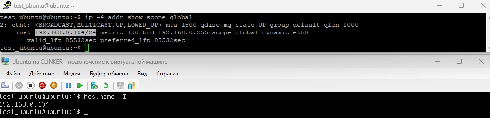

## Скриншоты

### Docker Hello World

### Custom Docker Container

## Часть 6: Описание выполненных действий

### Установка Git и использование GitHub аккаунта
Git был установлен на виртуальную машину с операционной системой Ubuntu (server version).

Сначала был обновлён список пакетов системы: `sudo apt update`

После этого Git был установлен через менеджер пакетов apt: `sudo apt install git`

Во время установки система автоматически скачала и установила необходимые зависимости.

После завершения установки была выполнена проверка версии Git, чтобы убедиться, что установка прошла успешно: `git --version`

Терминал вывел установленную версию Git, что подтвердило корректную установку.

Аккаунт на GitHub у меня уже был создан ранее, поэтому для выполнения задания использовался мой основной аккаунт.

Осуществил подключение к PuTTy по SSH.

### Создание репозитория и файла README.md
На платформе GitHub был создан новый публичный репозиторий с названием: my-first-devops

При создании репозитория сразу был добавлен файл README.md, для этого была отмечена соответствующая галочка "Add a README file".

После создания репозитория он был клонирован на локальный компьютер с помощью команды: `git clone git@github.com:desikJKE/my-first-devops.git`

Затем был выполнен переход в директорию проекта: `cd my-first-devops`

### Установка Docker и запуск контейнеров
Docker был установлен на основной пк согласно официальной документации Docker.

После установки была выполнена проверка корректности установки: `docker --version`

После этого для проверки работы Docker был запущен тестовый контейнер: `docker run hello-world`

Контейнер успешно запустился и вывел сообщение "Hello from Docker!", что подтвердило корректную работу Docker.

Также был создан собственный Dockerfile и Python-скрипт, после чего был собран Docker-образ и запущен контейнер, который выводит сообщение: Hello, DevOps World!

### Возможные проблемы и их решение
Первая проблема возникла при установке Docker. В тот момент наблюдались проблемы с серверами Cloudflare, из-за чего загрузка Docker с официального сайта временно была недоступна.

Вторая сложность возникла при добавлении изображений в файл README.md. Ранее я не использовал Markdown-синтаксис для вставки изображений, поэтому потребовалось изучить соответствующий синтаксис.

## Репозиторий
Ссылка на репозиторий:
https://github.com/desikJKE/my-first-devops/
